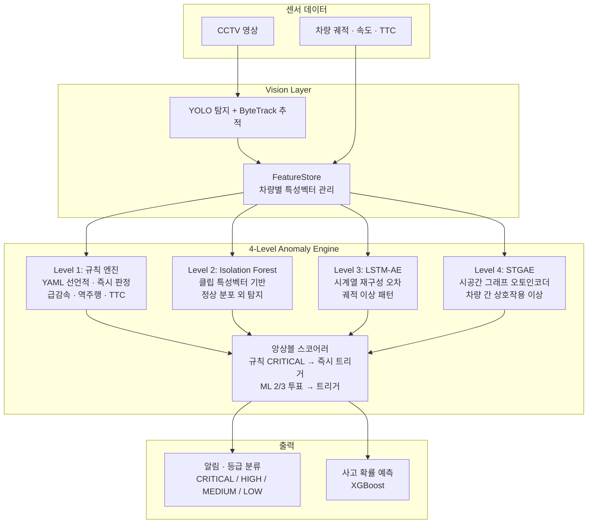

# Traffic Anomaly Detection

> CCTV 영상 기반 4-Level 이상징후 탐지 엔진 (규칙 -> Isolation Forest -> LSTM-AE -> STGAE 계층적 앙상블)


## Overview

고속도로 CCTV 영상에서 교통 이상상황(급감속, 정차, 역주행, 사고)을 실시간으로 탐지하는 시스템이다. 규칙 기반 빠른 판정(Level 1)부터 STGAE 기반 시공간 패턴 학습(Level 4)까지 4단계 계층적 앙상블로 구성되어, 명확한 이상은 즉시 탐지하고 미묘한 패턴은 딥러닝이 보완한다. AI Hub 교통 영상 데이터셋으로 학습하며, 향후 MLLM(Qwen2.5-VL) 통합을 통해 사고 원인 추론과 자동 보고서 생성까지 확장 설계되어 있다.

## Tech Stack

| 영역 | 기술 |
|------|------|
| 탐지/추적 | YOLO11n, ByteTrack |
| Level 1 | YAML 선언적 규칙 엔진 |
| Level 2 | Isolation Forest (scikit-learn) |
| Level 3 | LSTM AutoEncoder (PyTorch) |
| Level 4 | STGAE - Spatio-Temporal Graph AutoEncoder (PyTorch) |
| 앙상블 | 계층적 스코어러 (규칙 우선 + ML 투표) |
| 데이터 | AI Hub #71566, DuckDB |
| 예측 | XGBoost (사고 확률 예측) |

## Architecture



## Key Features

- **4-Level 계층적 탐지** -- 규칙(즉시) -> IForest(통계) -> LSTM-AE(시계열) -> STGAE(시공간 그래프) 순차 정밀화
- **YAML 선언적 규칙** -- 임계값/조건을 코드 수정 없이 YAML로 관리 (single/pair/group/special 4가지 타입)
- **STGAE 시공간 그래프** -- 차량 간 거리/속도 관계를 그래프로 모델링, 정상 패턴 재구성 오차로 이상 탐지
- **계층적 앙상블** -- 규칙 CRITICAL은 ML 결과와 무관하게 즉시 트리거, ML은 2/3 투표 합의로 판정
- **AI Hub 데이터 통합** -- #71566 교통 이상행동 데이터셋 파서, 정상/비정상 클립 자동 분류
- **사고 확률 예측** -- 축적된 이상징후 시계열 + 교통류 지표로 XGBoost 사고 예측 모델

## Getting Started

```bash
pip install torch scikit-learn xgboost duckdb numpy opencv-python
python -m src.anomaly_engine.test_engine --camera cam001 --video /path/to/video.mp4
# Level 2 학습: python -m src.anomaly_engine.level2_iforest --data_dir /path/to/aihub/
```

## Project Structure

```
traffic-anomaly-detection/
├── src/
│   ├── anomaly_engine/          # 이상징후 탐지 엔진
│   │   ├── engine.py            # 메인 오케스트레이터
│   │   ├── rule_engine.py       # Level 1: YAML 규칙 엔진
│   │   ├── level2_iforest.py    # Level 2: Isolation Forest
│   │   ├── level3_lstm_ae.py    # Level 3: LSTM AutoEncoder
│   │   ├── level4_stgae.py      # Level 4: STGAE 래퍼
│   │   ├── ensemble.py          # 계층적 앙상블 스코어러
│   │   ├── feature_store.py     # 차량 특성벡터 관리
│   │   └── alerter.py           # 알림 생성/등급 분류
│   ├── layer4_prediction/       # 사고 예측 (XGBoost)
│   └── config_new.py
├── external/stgae/              # STGAE 학습/평가 스크립트
├── models/                      # 학습된 가중치 (.pkl, .pt)
├── data/                        # AI Hub 데이터, 캘리브레이션
└── docs/                        # 설계 문서
```

## Technical Decisions

- **4-Level 계층 구조 채택**: 단일 모델로는 "급감속 + 정차"(명확)와 "서서히 속도 감소하는 지체"(미묘)를 동시에 커버하기 어렵다. 규칙으로 명확한 케이스를 즉시 잡고, ML로 미묘한 패턴을 보완하는 구조가 정확도와 응답속도 모두에서 우수했다.
- **STGAE (Level 4)**: 개별 차량 궤적만으로는 "다중 차량 연쇄 급감속" 같은 상호작용 기반 이상을 탐지할 수 없다. 차량 간 관계를 그래프 엣지로 모델링하여 시공간 동시 학습이 가능한 STGAE를 채택했다.
- **앙상블에서 규칙 우선**: 역주행/TTC 임박 같은 CRITICAL 상황은 ML 추론 시간(수십 ms)도 허용할 수 없다. 규칙 엔진이 O(N) 즉시 판정하고, ML은 비동기로 보완 점수를 제공하는 비대칭 구조를 적용했다.
